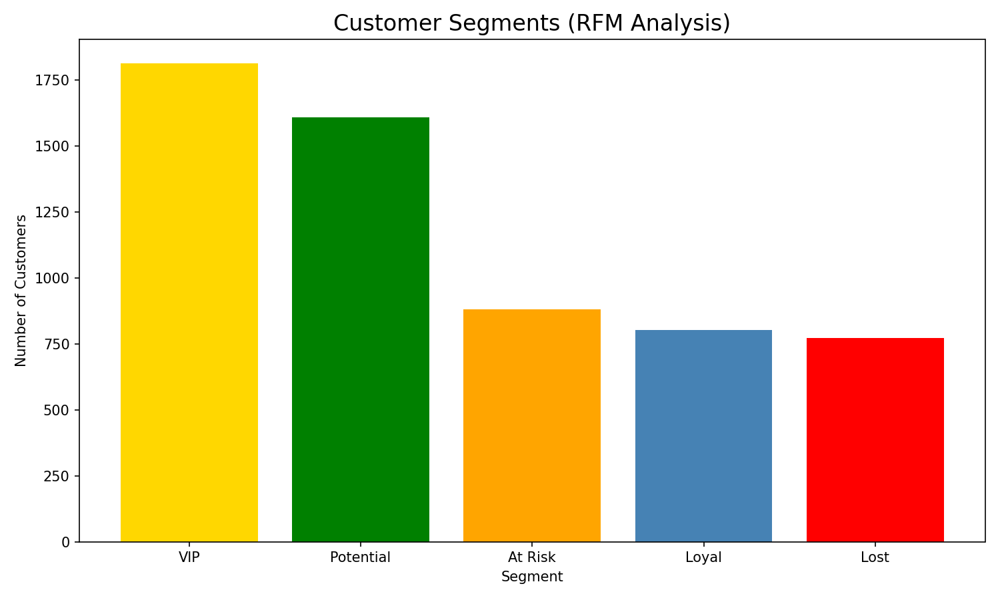
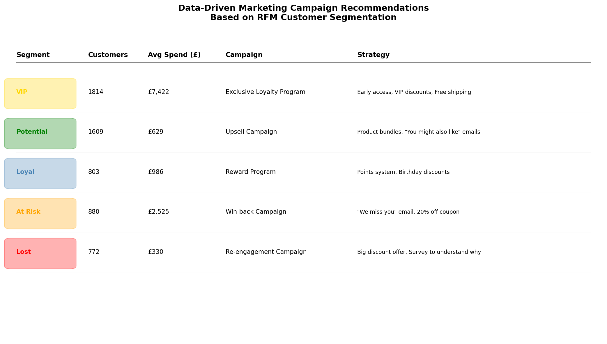
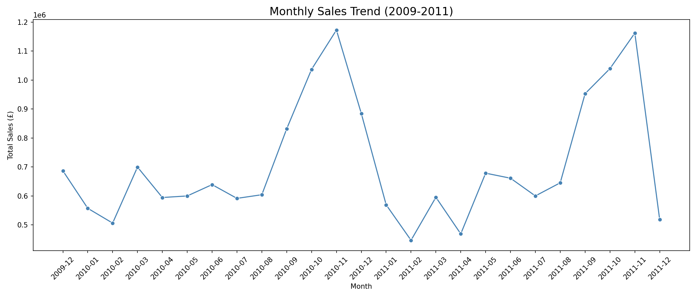

# E-Commerce Customer Analytics & Marketing Strategy

## Project Overview
Analyzed 1,067,371 real e-commerce transactions to segment customers using RFM Analysis and built data-driven marketing strategies for each segment, visualized through an interactive Power BI dashboard.

## Key Findings
- VIP customers (1,814) drive **75% of total revenue**
- 5,878 customers segmented into 5 actionable groups
- Peak sales identified in Q4 2011

## What I Did
- Data cleaning & preprocessing — removed cancelled orders, missing values
- RFM Customer Segmentation (Recency, Frequency, Monetary)
- Targeted marketing campaign recommendations per segment
- Interactive 2-page Power BI dashboard

## Customer Segments
| Segment | Customers | Avg Spend | Campaign |
|---------|-----------|-----------|----------|
| VIP | 1,814 | £7,422 | Exclusive Loyalty Program |
| Potential | 1,609 | £629 | Upsell Campaign |
| At Risk | 880 | £2,525 | Win-back Campaign |
| Loyal | 803 | £986 | Reward Program |
| Lost | 772 | £330 | Re-engagement Campaign |

## Tools Used
- **Python** — Pandas, Matplotlib, Seaborn, Scikit-learn
- **Power BI** — Interactive dashboard
- **Dataset** — [UCI Online Retail II](https://www.kaggle.com/datasets/mashlyn/online-retail-ii-uci)

## Visualizations

## Connect
- [LinkedIn](https://www.linkedin.com/posts/pathum-athukorala-a58a56298_datascience-marketing-python-activity-7454268492830384128-PB9r)
